# CyberLens
**Description:** Can you exploit the CyberLens web server and discover the hidden flags?  
**Difficulty:** Easy  
**Link:** https://tryhackme.com/r/room/cyberlensp6


We start by adding a line to the `/etc/hosts` file, mapping `cyberlens.thm` to the IP address of our target:

```
sudo echo '10.10.18.213 cyberlens.thm' >> /etc/hosts
```

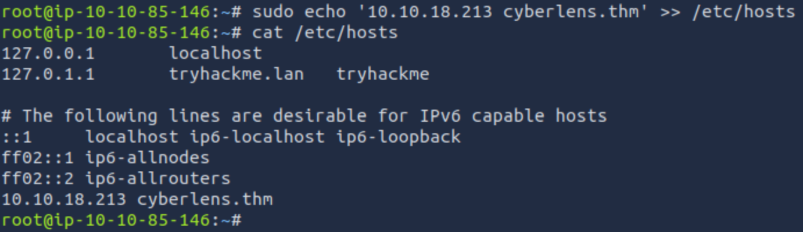

Now let's enter the information gathering phase. We first scan the target for open ports

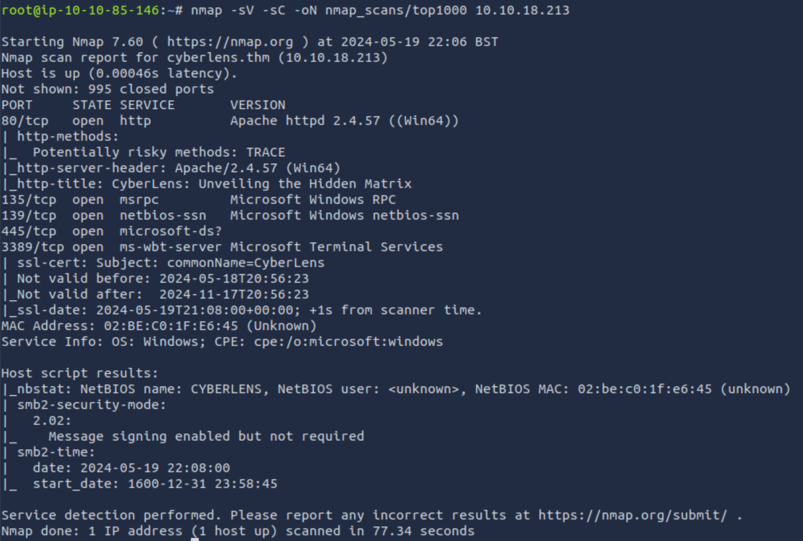

`-sV` enables version detection which tries to determine the actual protocol served on a port, version numbers, and other information. `-sC` runs all scripts in the `default` category, which among other things checks for anonymous FTP access. Finally `-oN` writes the output to a file. Since we didn't specify ports, nmap scans what it considers the top most 1000 ports.

We find five open ports:

* 80 TCP with an Apache web server running
* 135 TCP, likely the RPC endpoint mapper, a service providing port discovery for RPC services
* 139 and 445 TCP, both related to SMB
* 3389 TCP for RDP (Remote Desktop)

Now that we know which services are accessible to us, we need to perform appropriate information gathering techniques for each service to potentially find one or more vulnerabilities to exploit. Let's do that in order and start with HTTP on port 80.

We first open the website in Firefox and click on all the links we can find.

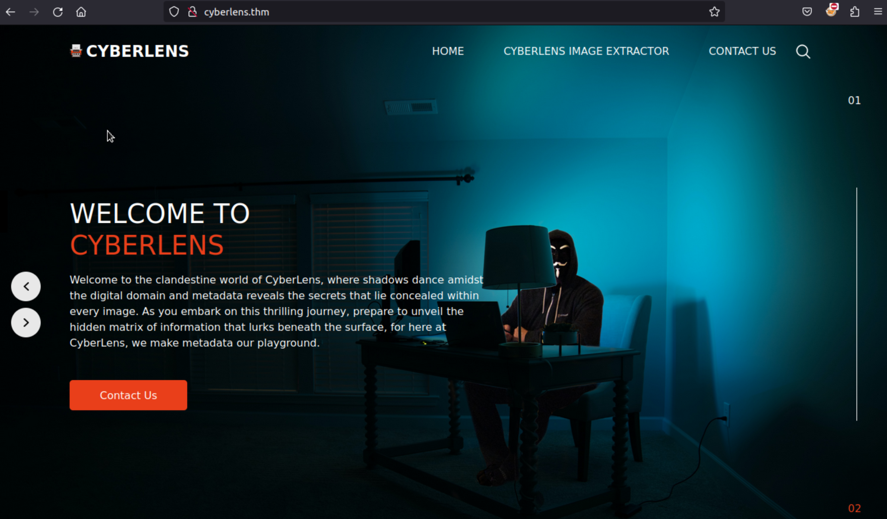

Exploring the website we find a contact form under `CONTACT US`, but it seems to be not doing anything, which the empty form action in the page's source (`Right click => View Page Source`) confirms:

```html
 <form action="">
```

Another option to make sure no data is sent anywhere when submitting the form would be to intercept all web traffic and send it to a software like Burp Suite, but this is not necessary here.

The other interesting find is the `CyberLens Image Extractor`, which allows us to load a local file and prints its metadata on the screen.

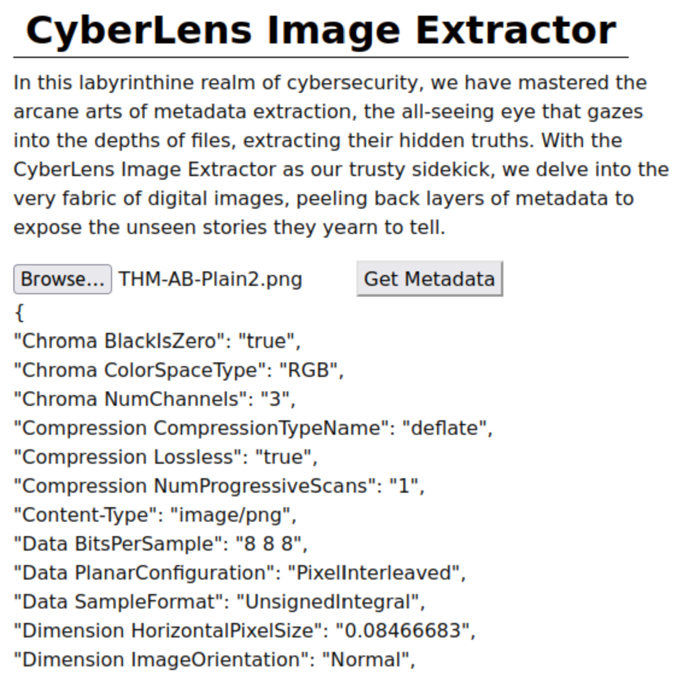

This has potential for a [file upload vulnerability](https://tryhackme.com/r/room/uploadvulns), so let's investigate what the code is doing. At the bottom of the source we find JavaScript that appears to implement the functionality of the Image Extrator. The interesting part is where an HTML request is made to the server:

```HTML
<script>
  ...
  
  fetch("http://cyberlens.thm:61777/meta", {
    method: "PUT",
    body: fileData,
    headers: {
      "Accept": "application/json",
      "Content-Type": "application/octet-stream"
    }
  })
  ...
  </script>
  ```

`61777` is a port we have not seen in our initial nmap scan. Let's have a look at it:

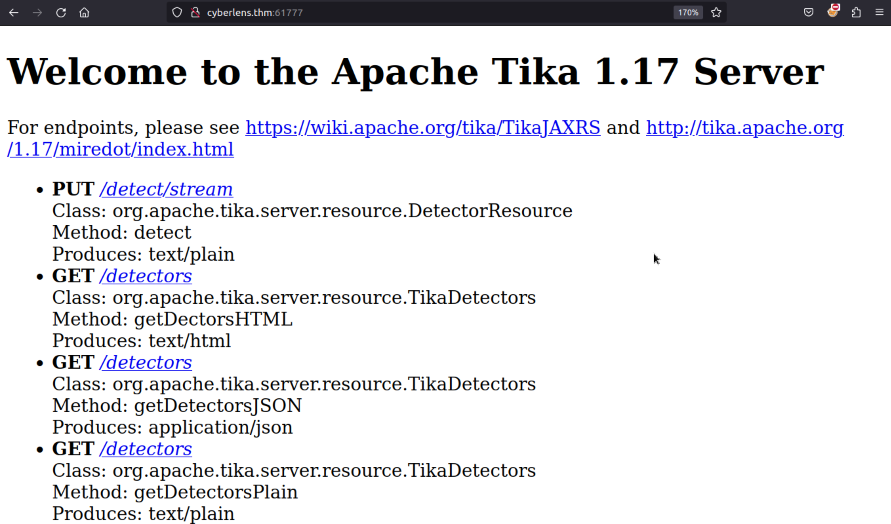

Since I've never heard of `Apache Tika` I google it

>The Apache Tika™ toolkit detects and extracts metadata and text from over a thousand different file types (such as PPT, XLS, and PDF). All of these file types can be parsed through a single interface, making Tika useful for search engine indexing, content analysis, translation, and much more.

[tika.apache.org](https://tika.apache.org/)

On the same page we spot that the current version of Apache Tika as of April 2024 is `2.9.2` but the target machine runs version `1.17` from 2017! Immediate question: Is there an unpatched vulnerability we can exploit? Let's check [exploit-db](https://www.exploit-db.com/):

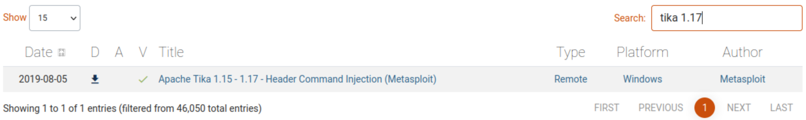

Houston, we have a problem. Or rather they. Without further ado we start the Metasploit console and search for the exploit:

```shell
msfconsole
```

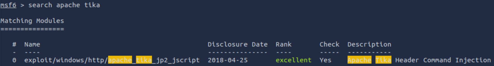

Now

`use 0`

activates the module. After getting more information on the exploit with `show info`

>This module exploits a command injection vulnerability in Apache Tika 1.15 - 1.17 on Windows.  A file with the image/jp2 content-type is used to bypass magic bytes checking.  When OCR is specified in the request, parameters can be passed to change the parameters passed at command line to allow for arbitrary JScript to execute. A JScript stub is passed to execute arbitrary code. This module was verified against version 1.15 - 1.17 on Windows 2012. While the CVE and finding show more versions vulnerable, during testing it was determined only > 1.14 was exploitable due to jp2 support being added.

and setting the required options (we must use the port Tika is listening on)

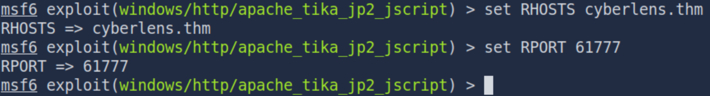

we can type `run` (or `exploit`) and let Metasploit do its magic. If it does not work the first time, simply try again. Within half a minute we have a shell on the target as user `CyberLens`:

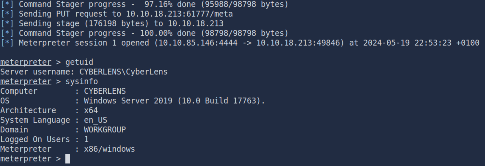

A bit of poking around and we find the user flag on the desktop

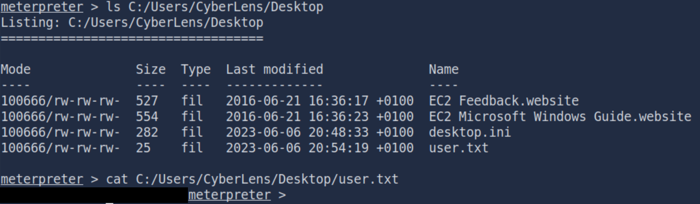

Next stop: Privilege escalation. 

As with other parts of the penetration testing process it's paramount to operate methodically (one could argue we violated this principle here by going straight for the exploit before finishing information gathering on other services). For me that means ticking off possible paths to privilege escalation from my notes, one by one. Notes that are based on tryhackme's [Windows Privilege Escalation](https://tryhackme.com/r/room/windowsprivesc20) room.

I looked at services, scheduled tasks, saved credentials, the Powershell history - to no avail.

Eventually I queried the registry for two keys that configure the `AlwaysInstallElevated` feature of Windows. If both

```
HKEY_CURRENT_USER\Software\Policies\Microsoft\Windows\Installer
```

and

```
HKEY_LOCAL_MACHINE\Software\Policies\Microsoft\Windows\Installer
```
are set to `1`, any user can install applications using `MSI` files with system privileges. From the [Microsoft documentation](https://learn.microsoft.com/en-us/windows/win32/msi/alwaysinstallelevated):

>This option is equivalent to granting full administrative rights, which can pose a massive security risk. Microsoft strongly discourages the use of this setting.

On our target we find:

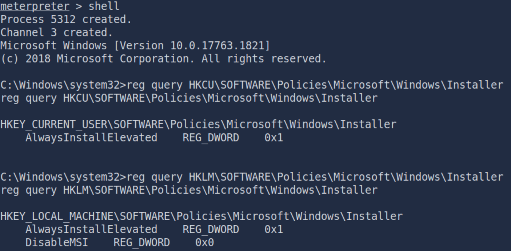

The `0x1` is a `1` written in hexadecimal, that's what we needed. From here we simply follow the [Windows Privilege Escalation room](https://tryhackme.com/r/room/windowsprivesc20) mentioned earlier.

We provide `msfvenom` with our attacker machine's IP address and a port for the reverse shell to generate the malicious `MSI` file,

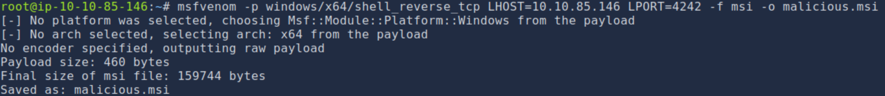

which we then upload to the target using the shell established by the Tika exploit earlier:

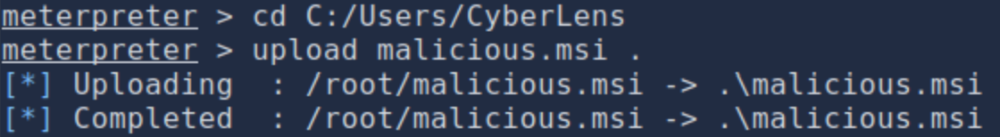

Another instance of `msfconsole` is configured and run to listen for the incoming connection from the reverse shell payload:

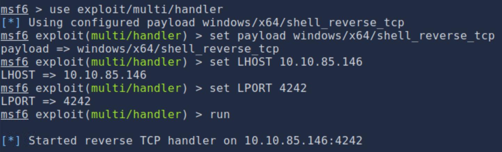

Once everything is set up we switch to the target machine and execute the payload:

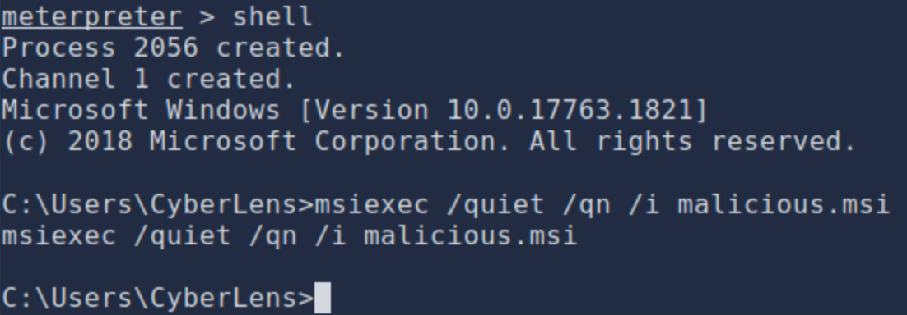

Back at our handler we find ourselves connected to the target:

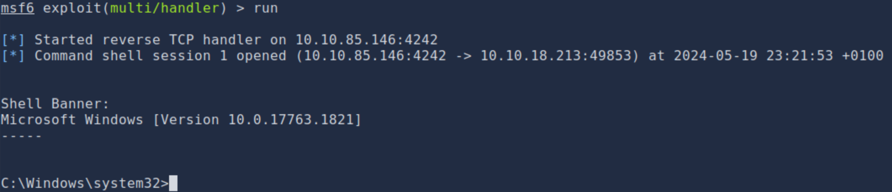

`whoami` confirms the exploit has worked and we have gained administrative privileges. The root flag is waiting for us on the `Administrator` user's desktop:

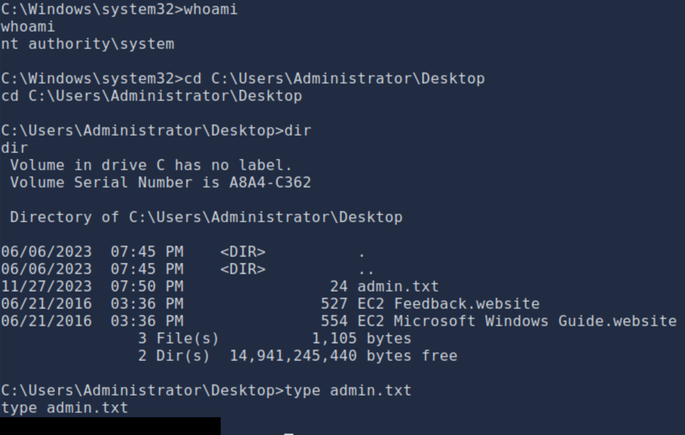

Given how many running services we found initially, I wouldn't be surprised to find other ways to solve this challenge. Maybe more elegant ones? In any case: This write-up does not claim to be complete and I encourage anyone to explore themselves, learning along the way. As always I hope it was useful and appreciate feedback!
