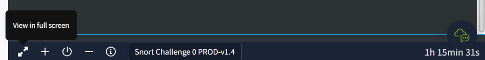
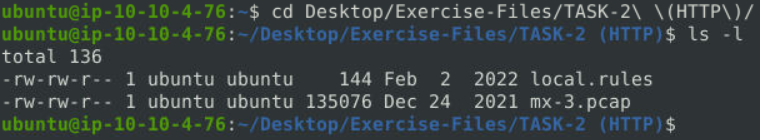
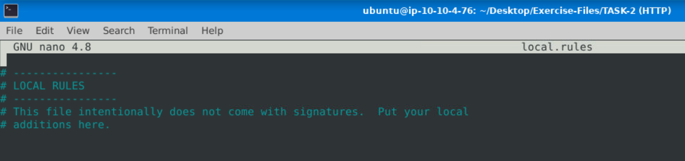
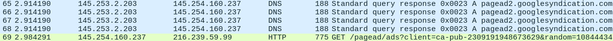

# Snort Challenge - The Basics
**Description:** Put your snort skills into practice and write snort rules to analyse live capture network traffic.  
**Difficulty:** Medium  
**Link:** [https://tryhackme.com/r/room/snortchallenges1](https://tryhackme.com/r/room/snortchallenges1)

## Task 1: Introduction

To work on this room we start the target VM attached to task 1 by clicking the green `Start Machine` button. The machine's virtual desktop pops up in split view on the right side of the screen. To open it in a separate window click the `View in full screen` icon in the lower left corner



and then minimize the split view with a click on `-`.

## Task 2: Writing IDS Rules (HTTP)

We open the terminal with a click on the icon in the upper left corner. After navigating to the task folder we find two files:



`mx-3.pcap` is the packet capture with the saved network traffic we need to analyze. `local.rules` is where we put our Snort rules. Let's open it with the easy-to-use text editor nano:

```shell
nano local.rules
```
The existing lines starting with the hashtag character `#` are comments which are ignored by Snort. We are going to add our rule to a new line below those.



Time for question 1:

>Write a single rule to detect "all TCP port 80 traffic" packets in the given pcap file. What is the number of detected packets?

One rule that accomplishes that (there are alternatives) is the following:

```
alert tcp any 80 <> any any (msg:"TCP port 80 traffic detected";sid:1000000000001; rev :1)
```

Let's go through it step by step:

* The [rule action](https://docs.snort.org/rules/headers/actions) is `alert` which does nothing but creating an alert. Other possible values include `block`, `drop`, `log` or even `rewrite`.
* The [protocol](https://docs.snort.org/rules/headers/protocols) is `tcp` as per question. Also possible are `ip`, `icmp`, and `udp`. Other protocols can be matched by manually creating rules.
* `any 80` means we match packets with `any` source [IP address](https://docs.snort.org/rules/headers/ips), since we don't care for where the data is coming from, and source [port](https://docs.snort.org/rules/headers/ports) 80  as provided by the question.
* `<>` is the bi-directional [direction operator](https://docs.snort.org/rules/headers/directions), meaning the rule matches in both ways: From source (left) to destination (right) as well as from destination to source.
* `any any` stands for `any` destination IP address and `any` destination port.

In other words: This rule creates an alert for all tcp packets that have port 80 either as source or destination port (or both), regardless of source and destination IP addresses.

What follows in parentheses are [rule options](https://docs.snort.org/rules/options/):

* `msg` is a human-readable message describing the rule that helps reading Snort output.
* `sid` is a unique ID that identifies each Snort rule. For user-generated rules this should be a value `>1000000` to not conflict with built-in rules. Having multiple rules with identical IDs in the same rules file can potentially result in wrong numbers in Snort's output.
* `rev` is the revision number of a rule. It should be incremented whenever a change is made to a rule, while keeping the `sid` constant.

After adding the rule to `local.rules`, saving the file (`Ctrl+O`) and exiting nano (`Ctrl+X`) the file should look like this:

```shell
ubuntu@ip-10-10-4-76:~/Desktop/Exercise-Files/TASK-2 (HTTP)$ cat local.rules 

# ----------------
# LOCAL RULES
# ----------------
# This file intentionally does not come with signatures.  Put your local
# additions here.
alert tcp any 80 <> any any (msg:"TCP port 80 traffic detected";sid:1000000000001; rev :1)
```

Now we can use Snort to apply the rule

```shell
sudo snort -r mx-3.pcap -c local.rules -l .
```

`-r` reads in the packet capture file, `-c` specifies which rules file to use and `-l .` logs the output to a new file in the current directory. This last option is crucial and omitting it leads to wrong answers to some of the questions. I explain why in the `How to go wrong` section at the end of this write-up.

At the bottom of the output we find the answer for question 1. The number of detected packets is:

```shell
Action Stats:
     Alerts:          [REDACTED] ( 35.652%)
     Logged:          [REDACTED] ( 35.652%)
     Passed:            0 (  0.000%)
```

For the rest of task 1 we use the new file created by Snort in the previous step. The filename follows the format `snort.log.<unix_timestamp>`, in my case:

```shell
ubuntu@ip-10-10-4-76:~/Desktop/Exercise-Files/TASK-2 (HTTP)$ ls -l
total 280
-rw-r--r-- 1 root   root    41868 Jun  8 23:55 alert
-rw-rw-r-- 1 ubuntu ubuntu    235 Jun  8 23:52 local.rules
-rw-rw-r-- 1 ubuntu ubuntu 135076 Dec 24  2021 mx-3.pcap
-rw------- 1 root   root   101904 Jun  8 23:55 snort.log.1717890906
```

On to the next question:

>What is the destination address of packet 63?

This can be answered by printig the first 63 packets from `snort.log.1717890906` to the screen and looking up the value at the end of the output:

```shell
sudo snort -r snort.log.1717890906 -A full -n 63
```

`-r` reads in the already processed/filtered file, `-A full` specifies the output format and `-n 63` instructs Snort to read and print the first 63 rows of data. Towards the end of the output, just above

```
===============================================================================
Run time for packet processing was 0.1533 seconds
``` 

indicating the end of processing we find the data we are interested in:

```
WARNING: No preprocessors configured for policy 0.
05/13-10:17:10.295515 145.254.160.237:3371 -> 216.[REDACTED]:80
TCP TTL:128 TOS:0x0 ID:3917 IpLen:20 DgmLen:761 DF
***AP*** Seq: 0x36C21E28  Ack: 0x2E6B5384  Win: 0x2238  TcpLen: 20
=+=+=+=+=+=+=+=+=+=+=+=+=+=+=+=+=+=+=+=+=+=+=+=+=+=+=+=+=+=+=+=+=+=+=+=+=+
```

The destination address of packet 63 is `216.[REDACTED]`. We repeat the last step for the remaining questions.

>What is the ACK number of packet 64?

```shell
sudo snort -r snort.log.1717890906 -A full -n 64
```

```
WARNING: No preprocessors configured for policy 0.
05/13-10:17:10.295515 145.254.160.237:3371 -> 216.239.59.99:80
TCP TTL:128 TOS:0x0 ID:3917 IpLen:20 DgmLen:761 DF
***AP*** Seq: 0x36C21E28  Ack: 0x2E[REDACTED]  Win: 0x2238  TcpLen: 20
=+=+=+=+=+=+=+=+=+=+=+=+=+=+=+=+=+=+=+=+=+=+=+=+=+=+=+=+=+=+=+=+=+=+=+=+=+
```

The ACK number of packet 64 is `0x2E[REDACTED]`.

>What is the SEQ number of packet 62?

```shell
sudo snort -r snort.log.1717890906 -A full -n 62
```

```
WARNING: No preprocessors configured for policy 0.
05/13-10:17:10.295515 145.254.160.237:3371 -> 216.239.59.99:80
TCP TTL:128 TOS:0x0 ID:3917 IpLen:20 DgmLen:761 DF
***AP*** Seq: 0x36[REDACTED]  Ack: 0x2E6B5384  Win: 0x2238  TcpLen: 20
=+=+=+=+=+=+=+=+=+=+=+=+=+=+=+=+=+=+=+=+=+=+=+=+=+=+=+=+=+=+=+=+=+=+=+=+=+
```

The SEQ number of packet 62 is `0x36[REDACTED]`.

The last three questions can be answered at once since they all relate to packet 65:

>What is the TTL of packet 65?
>
>What is the source IP of packet 65?
>
>What is the source port of packet 65?


```shell
sudo snort -r snort.log.1717890906 -A full -n 65
```

```
WARNING: No preprocessors configured for policy 0.
05/13-10:17:10.325558 145.[REDACTED]:3[REDACTED] -> 65.208.228.223:80
TCP TTL:1[REDACTED] TOS:0x0 ID:3918 IpLen:20 DgmLen:40 DF
***A**** Seq: 0x38AFFFF3  Ack: 0x114C81E4  Win: 0x25BC  TcpLen: 20
=+=+=+=+=+=+=+=+=+=+=+=+=+=+=+=+=+=+=+=+=+=+=+=+=+=+=+=+=+=+=+=+=+=+=+=+=+
```

The TTL of packet 65 is `1[REDACTED]`, the source IP `145.[REDACTED]`, and the source port `3[REDACTED]`.

## Task 3: Writing IDS Rules (FTP)

>Write a single rule to detect "all TCP port 21"  traffic in the given pcap. What is the number of detected packets?

Since the process is the same as for task 1 I will cover this only briefly. We change the directory and again have two files to work with:

```shell
ubuntu@ip-10-10-4-76:~/Desktop/Exercise-Files/TASK-2 (HTTP)$ cd ~/Desktop/Exercise-Files/TASK-3\ \(FTP\)/
ubuntu@ip-10-10-4-76:~/Desktop/Exercise-Files/TASK-3 (FTP)$ ls -l
total 60
-rw-rw-r-- 1 ubuntu ubuntu 57092 Dec 24  2021 ftp-png-gif.pcap
-rw-rw-r-- 1 ubuntu ubuntu   148 Feb  2  2022 local.rules
```

The rule for this question follows the structure of the one in task 2, except that this time we match port 21:

```shell
alert tcp any 21 <> any any (msg:"TCP port 21 traffic detected";sid:1000000000001; rev :1)
```

We add the rule to `local.rules` and apply it to the `ftp-png-gif.pcap` packet capture. Since this time we are only interested in the packet count and don't need to inspect individual packets, creating an intermediate file with `-l .` is not required.

```shell
sudo snort -r ftp-png-gif.pcap -c local.rules
```

From the output we can directly answer question 1:

```shell
Action Stats:
     Alerts:          [REDACTED] ( 72.922%)
     Logged:          [REDACTED] ( 72.922%)
     Passed:            0 (  0.000%)
```

Question 2

>What is the FTP service name?

requires a different approach. Because `ftp-png-gif.pcap` contains binary data opening it in a text editor won't yield much. To extract human-readable information from the file we can use the `strings` command. From the manual pages:

```
strings - print the sequences of printable characters in files
```

We pipe the output from `strings` into `grep` to search for occurances of `ftp` while ignoring case (`-i`):

```shell
strings ftp-png-gif.pcap | grep -i ftp
```

From the output we can copy and paste the correct answer. Question 3:

>Write a rule to detect failed FTP login attempts in the given pcap. What is the number of detected packets?

By either using a search engine or looking at the hint we learn that failed FTP login attemptes produce `530 User`. We can match the occurance of this string in the payload with the following rule:

```shell
alert tcp any any <> any any (msg:"Failed FTP login attempt detected";content:"530 User";sid:1000000000001; rev :1)
```

Since FTP can operate on any port we technically have to use `any` here instead of `21`, although with the provided packet capture the result is the same.

We apply the new rule (making sure the old one has been deleted or commented out from the file)

```shell
sudo snort -r ftp-png-gif.pcap -c local.rules
```

and get our answer. 

Question 4

>Write a rule to detect successful FTP logins in the given pcap. What is the number of detected packets?

We use the same rule as for failed FTP login attempts except this time the string is `230 User`:

```shell
alert tcp any any <> any any (msg:"Successful FTP login detected";content:"230 User";sid:1000000000001; rev :1)
```

Use the command from question 3 for the answer.

For Question 5

>Write a rule to detect FTP login attempts with a valid username but no password entered yet. What is the number of detected packets?

apply the same process with `331 Password`:

```shell
alert tcp any any <> any any (msg:"FTP - Valid user, no passwd";content:"331 Password";sid:1000000000001; rev :1)
```

To answer the final Question 6 we make use of the fact that the `content` option can be used multiple time within a single Snort rule:

```shell
alert tcp any any <> any any (msg:"FTP - user Administrator, no passwd";content:"331 Password";content:"Administrator";sid:1000000000001; rev :1)
```

## Task 4: Writing IDS Rules (PNG)

As this is a long room and the general process of creating rules and working with Snort has been covered in the previous three tasks, I try to be as concise as possible from now on. Question 1:

>Write a rule to detect the PNG file in the given pcap. Investigate the logs and identify the software name embedded in the packet.

Don't forget to change to the new task directory. We use [magic numbers](https://en.wikipedia.org/wiki/Magic_number_(programming)#In_files) to match packets that contain PNG files:

```shell
alert tcp any any <> any any  (msg: "PNG file detected"; content:"|89 50 4E 47 0D 0A 1A 0A|"; sid:1000000000001; rev:1;)
```

If a rule is already present in `local.rules` you can comment it out or delete it before adding yours. The pipe symbols instruct Snort to match [hexadecimal bytes](https://docs.snort.org/rules/options/payload/content). We filter the provided .pcap to an intermediate file:

```shell
sudo snort -r ftp-png-gif.pcap -c local.rules -l .
```

and extract human-readable text from it using `strings` to find the answer:

```shell
sudo strings snort.log.1717895123
```

Next, Question 2:

>Write a rule to detect the GIF file in the given pcap. Investigate the logs and identify the image format embedded in the packet.

Quoting [Wikipedia](https://en.wikipedia.org/wiki/Magic_number_(programming)#In_files):

```
GIF image files have the ASCII code for "GIF89a" (47 49 46 38 39 61) or "GIF87a" (47 49 46 38 37 61)
```

We try with one rule for each variant:

```shell
alert tcp any any <> any any  (msg: "GIF89a file detected"; content:"|47 49 46 38 39 61|"; sid:1000000000001; rev:1;)
```

```shell
alert tcp any any <> any any  (msg: "GIF87a file detected"; content:"|47 49 46 38 37 61|"; sid:1000000000001; rev:1;)
```

Only one of them results in alerts when running

```shell
sudo snort -r ftp-png-gif.pcap -c local.rules
```

The one that does provides the correct answer.


## Task 5: Writing IDS Rules (Torrent Metafile)

>Write a rule to detect the torrent metafile in the given pcap. What is the number of detected packets?

The rule should suffice:

```shell
alert tcp any any <> any any  (msg: ".torrent file detected"; content:".torrent"; sid:1000000000001; rev:1;)
```

>Investigate the log/alarm files. What is the name of the torrent application?

Using the rule above we log the filtered packet capture to an intermediate file:

```shell
sudo snort -r torrent.pcap -c local.rules -l .
```

and look at its strings

```shell
sudo strings snort.log.1717896052
```

The output also contains the answer to the last two questions

>What is the MIME (Multipurpose Internet Mail Extensions) type of the torrent metafile?

and

>What is the hostname of the torrent metafile?


## Rule 6: Troubleshooting Rule Syntax Errors

```shell
# local-1.rules
# wrong
alert tcp any 3372 -> any any(msg: "Troubleshooting 1"; sid:1000001; rev:1;)
# correct
alert tcp any 3372 -> any any (msg: "Troubleshooting 1"; sid:1000001; rev:1;)
```

```shell
# local-2.rules
# wrong
alert icmp any -> any any (msg: "Troubleshooting 2"; sid:1000001; rev:1;)
# correct
alert icmp any any -> any any (msg: "Troubleshooting 2"; sid:1000001; rev:1;)
```

```shell
# local-3.rules
# wrong
alert icmp any any -> any any (msg: "ICMP Packet Found"; sid:1000001; rev:1;)
alert tcp any any -> any 80,443 (msg: "HTTPX Packet Found"; sid:1000001; rev:1;)
# correct
alert icmp any any -> any any (msg: "ICMP Packet Found"; sid:1000001; rev:1;)
alert tcp any any -> any 80,443 (msg: "HTTPX Packet Found"; sid:1000002; rev:1;)
```

```shell
# local-4.rules
# wrong
alert icmp any any -> any any (msg: "ICMP Packet Found"; sid:1000001; rev:1;)
alert tcp any 80,443 -> any any (msg: "HTTPX Packet Found": sid:1000001; rev:1;)
# correct
alert icmp any any -> any any (msg: "ICMP Packet Found"; sid:1000001; rev:1;)
alert tcp any 80,443 -> any any (msg: "HTTPX Packet Found"; sid:1000002; rev:1;)
```

```shell
# local-5.rules
# wrong
alert icmp any any <> any any (msg: "ICMP Packet Found"; sid:1000001; rev:1;)
alert icmp any any <- any any (msg: "Inbound ICMP Packet Found"; sid;1000002; rev:1;)
alert tcp any any -> any 80,443 (msg: "HTTPX Packet Found": sid:1000003; rev:1;)
# correct
alert icmp any any <> any any (msg: "ICMP Packet Found"; sid:1000001; rev:1;)
alert icmp any any -> any any (msg: "Inbound ICMP Packet Found"; sid:1000002; rev:1;)
alert tcp any any -> any 80,443 (msg: "HTTPX Packet Found"; sid:1000003; rev:1;)
```

```shell
# local-6.rules
# wrong
alert tcp any any <> any 80  (msg: "GET Request Found"; content:"|67 65 74|"; sid: 100001; rev:1;)
# correct
alert tcp any any <> any 80  (msg: "GET Request Found"; content:"|47 45 54|"; sid: 100001; rev:1;)
```

Converting the HEX bytes to ASCII using [CyberChef](https://gchq.github.io/CyberChef/#recipe=From_Hex('Auto')&input=NjcgNjUgNzQ) reveals that `67 65 74` represents lowercase `get`. Since the HTTP method `GET` is uppercase and case-sensitive we need the appropriate HEX value for `GET` instead. Again using [CyberChef](https://gchq.github.io/CyberChef/#recipe=To_Hex('Space',0)&input=R0VU) we find `47 45 54`.

```shell
# local-7.rules
# wrong
alert tcp any any <> any 80  (content:"|2E 68 74 6D 6C|"; sid: 100001; rev:1;)
# correct
alert tcp any any <> any 80  (msg: ".http file found"; content:"|2E 68 74 6D 6C|"; sid: 100001; rev:1;)
```

## Task 7: Using External Rules (MS17-010)

>Use the given rule file (local.rules) to investigate the ms1710 exploitation. What is the number of detected packets?

Change to the task directory

```shell
cd ~/Desktop/Exercise-Files/TASK-7\ \(MS17-10\)/
```

execute Snort

```shell
sudo snort -r ms-17-010.pcap -c local.rules
```

and read the answer from the output.

>Use local-1.rules empty file to write a new rule to detect payloads containing the "\IPC$" keyword. What is the number of detected packets?

Filtering directly for the string `\IPC$` results in an error:

```shell
ERROR: local-1.rules(8) Bad escape sequence starting with "\IPC$".
```

From the [Snort documentation](https://docs.snort.org/rules/options/payload/content) we learn that `\` must be escaped with `\`. 

```
Note: Certain characters must be either escaped (with '\' characters) or encoded in hex. These are: ';', '\', and '"'.
```
giving us this rule:

```shell
alert tcp any any <> any any  (msg: "Keyword found"; content:"\\IPC$"; sid: 1000000000001; rev:1;)
```

Another possibility is to convert '\IPC$' to HEX using [CyberChef](https://gchq.github.io/CyberChef/#recipe=To_Hex('Space',0)&input=XElQQyQ) first and use that in the rule:

```shell
alert tcp any any <> any any  (msg: "Keyword found"; content:"|5c 49 50 43 24|"; sid: 1000000000001; rev:1;)
```

>Investigate the log/alarm files. What is the requested path?

We log the filtered packet capture to an intermediate file:

```shell
sudo snort -r ms-17-010.pcap -c local-1.rules -l .
```

and look at its strings

```shell
sudo strings snort.log.1717898210
```

>What is the CVSS v2 score of the MS17-010 vulnerability?

Typing `cvss v2 MS17-010` into a search engine of choice we find [MS17-010: Security Update for Microsoft Windows SMB Server (4013389) (ETERNALBLUE) (ETERNALCHAMPION) (ETERNALROMANCE) (ETERNALSYNERGY) (WannaCry) (EternalRocks) (Petya)](https://www.tenable.com/plugins/nessus/97737). The score is under `Risk Information` on the right side.

## Task 8: Using External Rules (Log4j)

>What is the number of detected packets?

Change to the task directory

```shell
cd ~/Desktop/Exercise-Files/TASK-8\ \(Log4j\)/
```

execute Snort

```shell
sudo snort -r log4j.pcap -c local.rules
```

and read the answer from the output.

>How many rules were triggered?.

There are different ways to answer this. Here I use one that perfectly demonstrates the [Unix philosophy](https://en.wikipedia.org/wiki/Unix_philosophy). We log the filtered packet capture to an intermediate file again:

```shell
sudo snort -r log4j.pcap -c local.rules -l .
```

This also generates a filed called `alert` which we then [pipe](https://en.wikipedia.org/wiki/Pipeline_(Unix)) through a series of helpers to get the answer:

```
cat alert | grep -F [**] | sort | uniq | wc -l
```

* `cat alert` reads the file and passes its content on
* `grep -F [**]` filters the lines to include only those containing [**]
* `sort` sorts these filtered lines, which is required for `uniq` to work
* `uniq` removes any duplicate lines from the sorted list
* `wc -l` counts the number of lines


>Investigate the log/alarm files. What are the first six digits of the triggered rule sids?

```shell
sudo snort -r log4j.pcap -c local.rules
```

The rules are listed with their IDs at the very end of the output.

>Use local-1.rules empty file to write a new rule to detect packet payloads between 770 and 855 bytes. What is the number of detected packets?

The rule is

```shell
alert tcp any any <> any any  (msg: "Between 770 and 855 bytes"; dsize: 770<>855; sid: 1000000000001; rev:1;)
```

Run

```shell
sudo snort -r log4j.pcap -c local-1.rules
```

for the answer.

>Investigate the log/alarm files. What is the name of the used encoding algorithm?

We log the filtered packet capture to an intermediate file:

```shell
sudo snort -r log4j.pcap -c local-1.rules -l .
```

and print it to the screen with the `-A cmg` option to include payload data in the console output:

```shell
sudo snort -r snort.log.1717900099 -A cmg
```

Scrolling through the output we find the answer in the second to last packet. The corresponding IP ID

>What is the IP ID of the corresponding packet?

is displayed in the header section of the same packet.

>Decode the encoded command. What is the attacker's command?

In the payload of the same packet we looked at to answer the last two questions we find a string encoded with a common encoding algorithm. Using [CyberChef](https://gchq.github.io/CyberChef/) or a similar tool we can decode it and paste the entire output into the anwser box on tryhackme.

>What is the CVSS v2 score of the Log4j vulnerability?

Typing `cvss v2 Log4j` into a search engine of choice we find [CVE-2021-44228 Detail](https://nvd.nist.gov/vuln/detail/CVE-2021-44228). A click on `CVSS Version 2.0` under `Severity` reveals the score we're looking for.


## How to go wrong

A common mistake in tasks 2 and 3 is not using an intermediate file. If instead you directly go for let's say packet 65 with a line like

```shell
sudo snort -r mx-3.pcap -c local.rules -A cmg -n 65
```

you end up with wrong answers. The reason as far as I can tell is the order in which Snort operates. It first reads the first 65 packets from the file specified with `-r`, then secondly applies the rule(s) in `local.rules`, and lastly prints the output to the screen.

Imagine a packet capture file with the following content:

```
packet_tcp80_A
packet_tcp80_B
packet_tcp80_C
packet_tcp21
packet_udp53
packet_tcp80_D
packet_tcp80_E
```

If you were tasked to filter for `tcp port 80` and in a second step provide the source IP of packet 4, you'd want to look at `packet_tcp80_D`. The fourth packet that matches the condition.

This wrong command

```shell
sudo snort -r file.pcap -c local.rules -A cmg -n 4
```

would instead read the first four packets from the file

```
packet_tcp80_A
packet_tcp80_B
packet_tcp80_C
packet_tcp21
```

then apply the rule and what you end up seeing at the end of the output is

```shell
packet_tcp80_C
```

The `.pcap` provides in task 2 happens to contain DNS traffic in packets number `43`, `46`, `49`, `52`, and `65-68`, causing offsets when using the wrong method.



Using an intermediate file as shown avoids this. The original `.pcap` is first filtered and written to a new file, in which we are then looking at specific packet numbers.

Another common mistake is to copy and paste rules from old write-ups for tasks 2 and 3. Rule files such as this one

```shell
alert tcp any 80 <> any any (msg:"TCP port 80 inbound traffic detected";sid:1000000000001; rev :1)
alert tcp any any <> any 80 (msg:"TCP port 80 outbound traffic detected";sid:1000000000002; rev :1)
```

use two rules, each with the bi-directional operator `<>`, resulting in matching packets being counted twice. In fact the number of alerts ends up being higher than the total number of packets in the `.pcap` file.
